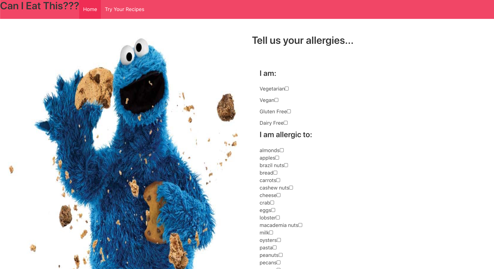
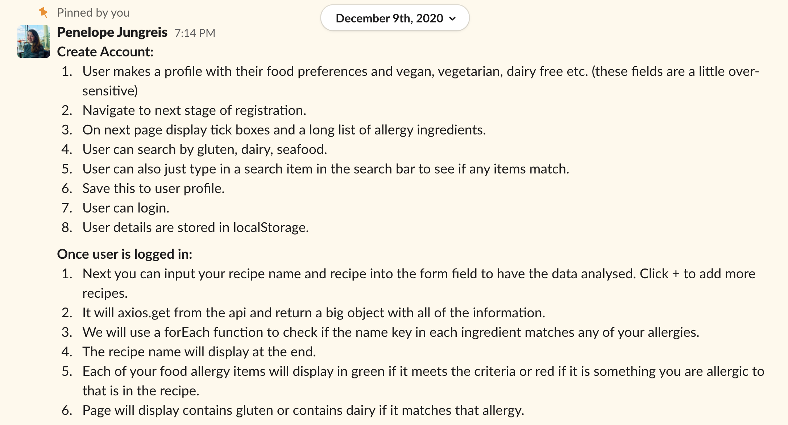
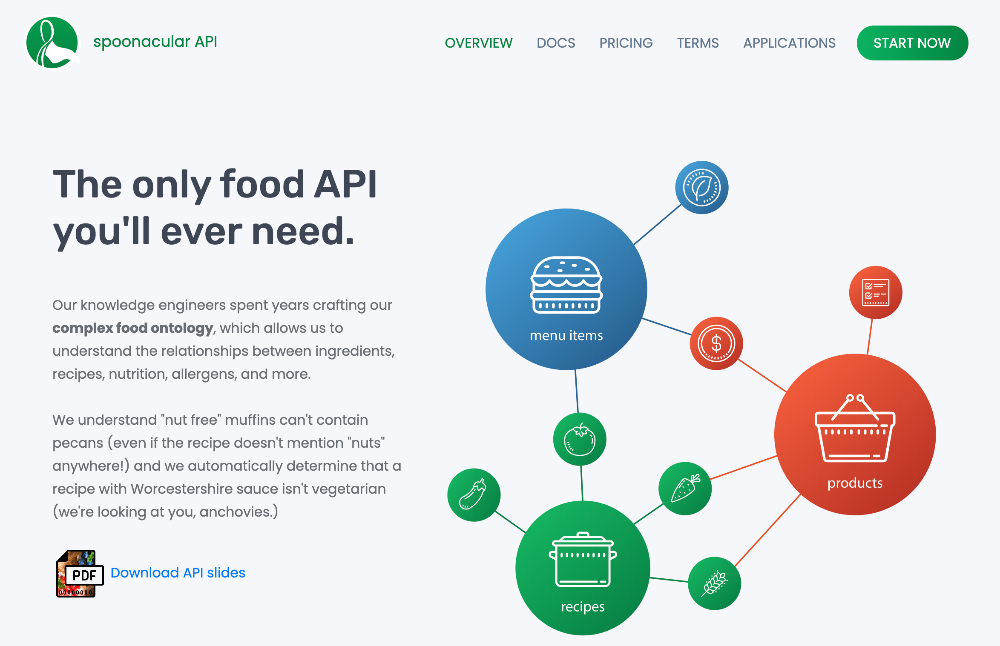
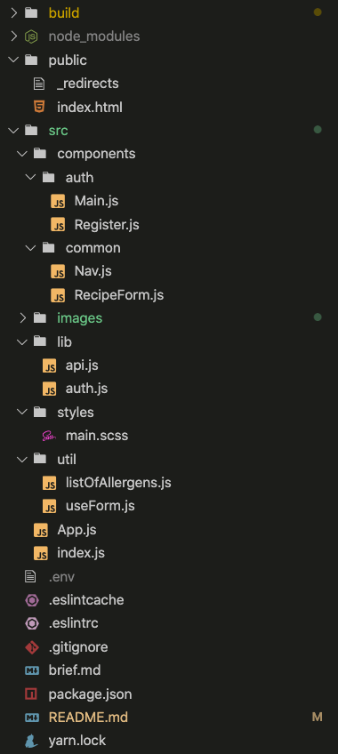
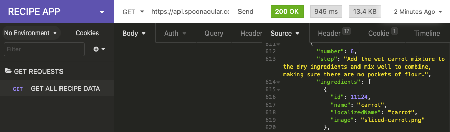
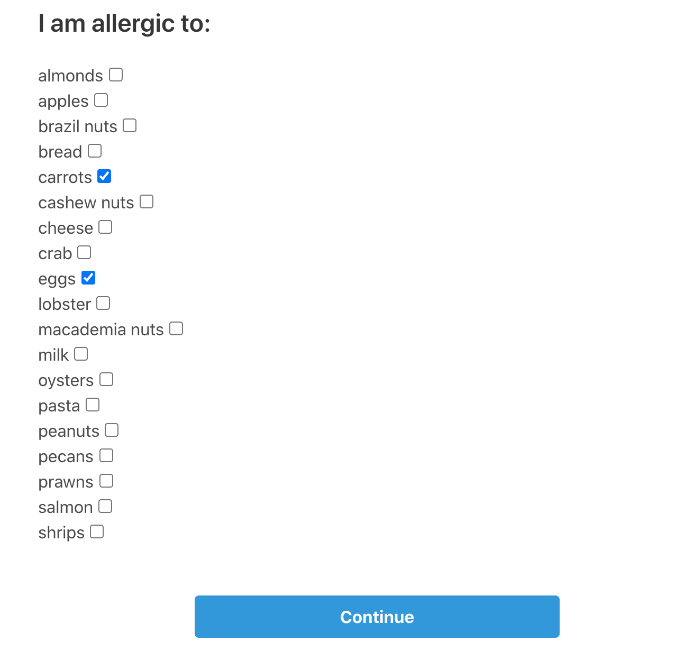
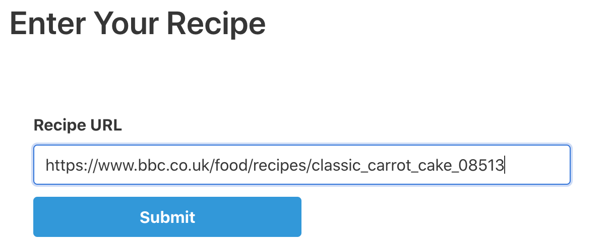
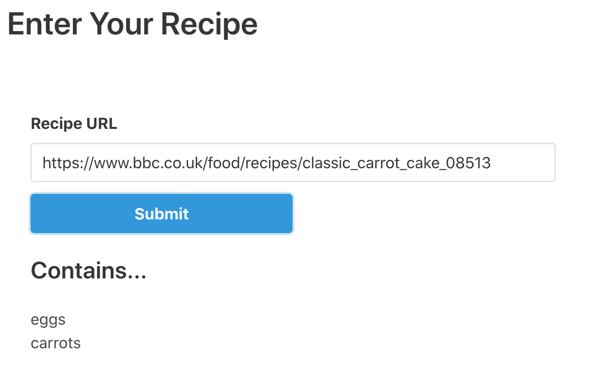
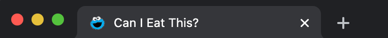
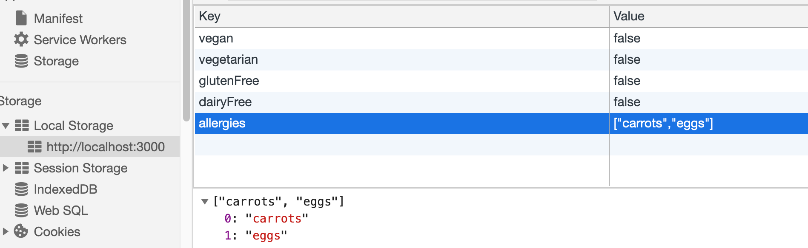

# 🍪 Can I Eat This? - A Front-end React App
A React app built during a 48hr hackathon. Uses the [Spoonacular API](https://spoonacular.com/food-api). My first pair project for General Assembly's Software Engineering Immersive.
### Developed by:
* Alberto Cerrone - [GitHub](https://github.com/albertocerrone)

* Penny Jungreis - [GitHub](https://github.com/penelopecj)



## Deployment
I deployed this website on Netlify and it is available [_here_](https://recipe-allergies.netlify.app/).

## Concept
**Can I Eat This** is a site where users can select their allergies and dietary restrictions from a list, then input any recipe URL from the web. The site will produce a list of the user's allergens that are contained in the recipe.

## Project #2 Brief: Reacathon
* 48 hours to build a React application that consumes a public API.
* Public API could have been anything, but needed to make sense for our project.
* Have several components, including at least one classical and one functional.
* The app can have a router with several "pages", which was up to our disgression if it made sense for our project.
* Include wireframes that we designed before building the app.
* Be deployed online and accessible to the public.
* A git repository hosted on Github, with a link to our hosted project and frequent commits dating back to the very beginning of the project.
* A working request in Insomnia from the API we want to use, showing that we can access the dataset we need.
## Technologies Used
* **API**:
  * [Spoonacular API](https://spoonacular.com/food-api)
* **Frontend**:
  * JavaScript (ES6)
  * React.js
  * HTML5
  * CSS3
  * Axios
  * react-router-dom
  * Bulma
* **Development Tools**:
  * VS Code
  * Git + GitHub
  * Insomnia
  * Live Share
  * Netlify
## Installation Instructions
1. Clone repo code from GitHub onto your machine.
2. Use `yarn` or `npm` to install all dependencies from the `package.json` file.

## User Stories & Wireframes

**Basic User Story**



## General Approach & Planning
* We first had to choose an API we wanted to use. My partner and I realised we both have a passion for fine food and love to try new recipes, so we decided to use the very popular [Spoonacular API](https://spoonacular.com/food-api).

**API of our choice**



### DAY 1

* We began by chatting through a very basic user story and wireframe of our apps design and components, given the limited time we had.
* We wrote throwaway code to explain our thought process to each other and to solve short term problems.
* We first took the time to read the docs for Bulma and the Spoonacular API we were using.
* We decided to pair code most of the app on VS Code Live Share so we could pool or knowledge and get more built quickly in the short time we had.
* We began by writing pseudocode before writing actual code to help us think through the logic first.
* We weren't too concerned with writing DRY code at the time, as we wanted to achieve a lot of functionality in 48 hours. We decided we would come back to re-factor repetitive code later on.
* We discussed and agreed on consistent code styles, indentation, and naming conventions.
* We made sure to commit early and often in case we broke something and needed to roll back to a previous version.
* We kept our user stories small and well-defined, trying to always come back to what our target user would actually want and need.
* We began by scaffolding a basic React app from a template.
* We then built our file structure as below.



* Next, we used `react-router-dom` to set up our App.js as the router for the site. 

```
import { BrowserRouter, Switch, Route } from 'react-router-dom'
```

```
return (
    <BrowserRouter>
      <Nav />
      <Switch>
        <Route exact path="/" component={Main}/>
        <Route exact path="/register" component={Register}/>
        <Route path="/recipes" component={RecipeForm} />
      </Switch> 
    </BrowserRouter>
  )
```

* Then we used Insomnia to check that we could retrieve the data we needed from the API.



* We wrote this little function to get the data from the API for our app.

```
import axios from 'axios'

const baseUrl = 'https://api.spoonacular.com'
const myAPI = process.env.REACT_APP_MY_API_KEY

export function getRecipeInfo(pageUrl){
  return axios.get(`${baseUrl}/recipes/extract?apiKey=${myAPI}&url=${pageUrl}`)
}
```
* We next built the UI and layout for the allergy form using Bulma columns.



* This information about the user gets stored in local storage, and the user can click ::Continue:: to navigate to the recipe checker component.

* We made a URL text input that can take any url from an onlie recipe.


### DAY 2
* Debugging
## Wins
* Used a custom React hook to handle the form state manipulation and checkboxes. Used an object spread to create a new object every time, triggering the React state to change and the browser to re-render.

```
function useForm(initialState) {
  const [formdata, setFormdata] = React.useState(initialState)

  const handleChange = event => {
    setFormdata({ ...formdata, [event.target.name]: event.target.value })
  }

  return {
    formdata,
    handleChange,
  }
}
export default useForm
```

* The biggest win for me, right before the end of the hackathon, was checking the allergies from the array in local storage against the ingredients in the recipe and displaying the list of matches on the page.




* Another finishing touch was when I figured out how to change the favicon on the browser tab.




## Challenges Overcome
* The greatest challenge we faced was manipulating the browser local storage to keep track of users dietary restrictions from the allergy form. We got there in the end, but this was something we had never done before that took up most of our time on the second day.



## Key Learnings
* First React app
* First time pair coding
* First time using Live Share - difficult
* First sinlge-page application
* First hackathon


## Unsolved Problems


## Features Wish List
* We didn't have time in the short hackathon, but the dream is to convert this into a Chrome browser extension that could check the ingredients on any recipe when you arrive on the page.

✨ ***PRs welcome!*** ✨

## Credits