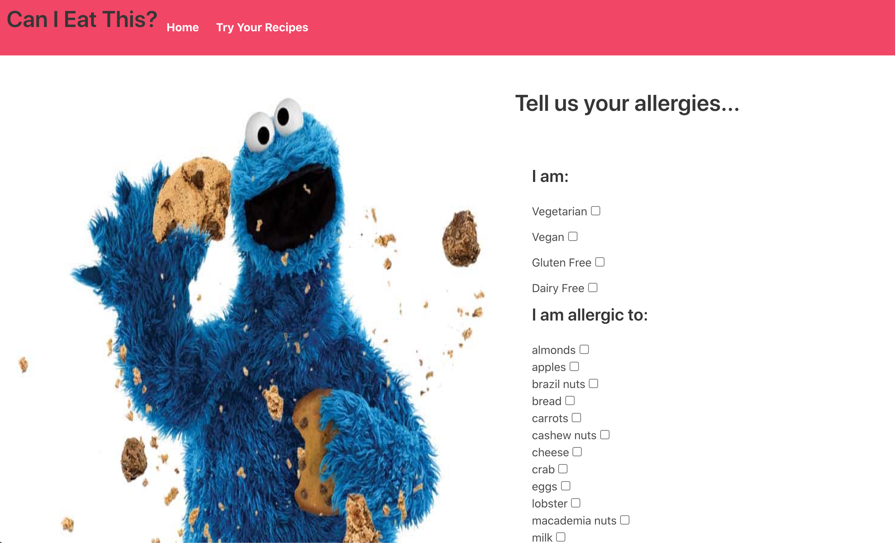

# 🍪 Can I Eat This? - A Frontend React App
A React app built during a 48-hour hackathon, using the [Spoonacular API](https://spoonacular.com/food-api). My first pair-coding project for General Assembly's Software Engineering Immersive.
### Developed by:
* Penny Jungreis - [GitHub](https://github.com/penelopecj)

* Alberto Cerrone - [GitHub](https://github.com/albertocerrone)



## Deployment
I deployed this website on Netlify and it is available [_here_](https://recipe-allergies.netlify.app/).

## Concept
**Can I Eat This** is a site where users can select their allergies and dietary restrictions from a list, then input any recipe URL from the web. The site will produce a list of the user's allergens that are contained in the recipe.

## Project Brief: Reacathon
* 48 hours to build a React application that consumes a public API.
* Public API could have been anything, but needed to make sense for our project.
* Have several components, including at least one classical and one functional.
* The app can have a router with several "pages", which was up to our disgression if it made sense for our project.
* Include wireframes that we designed before building the app.
* Be deployed online and accessible to the public.
* A git repository hosted on Github, with a link to our hosted project and frequent commits dating back to the very beginning of the project.
* A working request in Insomnia from the API we want to use, showing that we can access the dataset we need.
## Technologies Used
* **API**:
  * [Spoonacular API](https://spoonacular.com/food-api)
* **Frontend**:
  * JavaScript (ES6)
  * React.js
  * HTML5
  * SASS
  * Axios
  * react-router-dom
  * Bulma
* **Development Tools**:
  * VS Code
  * Git + GitHub
  * Insomnia
  * Live Share
  * Netlify
## Installation Instructions
1. Clone repo code from GitHub onto your machine.
2. Use `yarn` or `npm` to install all dependencies from the `package.json` file.

## User Stories & Wireframes

**Basic User Story**


## General Approach & Planning
* We first had to choose an API we wanted to use. My partner and I realised we both have a passion for fine food and love to try new recipes, so we decided to use the very popular [Spoonacular API](https://spoonacular.com/food-api).

**API of our choice**


### DAY 1

* We began by chatting through a very basic user story and wireframe of our apps design and components, given the limited time we had.
* We wrote throwaway code to explain our thought process to each other and to solve short term problems.
* We first took the time to read the docs for Bulma and the Spoonacular API we were using.
* We decided to pair code most of the app on VS Code Live Share so we could pool our knowledge and get more built quickly in the short time we had.
* We began by writing pseudocode before writing actual code to help us think through the logic first.
* We weren't too concerned with writing DRY code at the time, as we wanted to achieve a lot of functionality in 48 hours. We decided we would come back to re-factor repetitive code later on.
* We discussed and agreed on consistent code styles, indentation, and naming conventions.
* We made sure to commit early and often in case we broke something and needed to roll back to a previous version.
* We kept our user stories small and well-defined, trying to always come back to what our target user would actually want and need.
* We saved time by scaffolding a basic React app from a template.
* We then built our file structure as below.


* Next, we used `react-router-dom` to set up our App.js as the router for the site. 

```
import { BrowserRouter, Switch, Route } from 'react-router-dom'
```

```
return (
    <BrowserRouter>
      <Nav />
      <Switch>
        <Route exact path="/" component={Main}/>
        <Route exact path="/register" component={Register}/>
        <Route path="/recipes" component={RecipeForm} />
      </Switch> 
    </BrowserRouter>
  )
```

* Then we used Insomnia to check that we could retrieve the data we needed from the API.


* We wrote this little function to get the data from the API for our app.

```
import axios from 'axios'

const baseUrl = 'https://api.spoonacular.com'
const myAPI = process.env.REACT_APP_MY_API_KEY

export function getRecipeInfo(pageUrl){
  return axios.get(`${baseUrl}/recipes/extract?apiKey=${myAPI}&url=${pageUrl}`)
}
```
* We next built the UI and layout for the allergy form using Bulma columns.


* This information about the user gets stored in local storage with the following React states and change functions.

**User dietary resrictions stored as a default object in state**
```
const [user, setUser] = React.useState({
    vegetarian: false,
    vegan: false,
    glutenFree: false,
    dairyFree: false,
    allergies: [],
  })
```
**Check the truthy or falsiness of each value currently in local storage and set the values accordingly in state**
```
  const [vegetarian, setVegetarian] = React.useState(() => {
    const currentState = window.localStorage.getItem('vegetarian')
    if (currentState) return JSON.parse(currentState)
    return false
  })
  const [vegan, setVegan] = React.useState(() => {
    const currentState = window.localStorage.getItem('vegan')
    if (currentState) return JSON.parse(currentState)
    return false
  })
  const [glutenFree, setGlutenFree] = React.useState(() => {
    const currentState = window.localStorage.getItem('glutenFree')
    if (currentState) return JSON.parse(currentState)
    return false
  })
  const [dairyFree, setDairyFree] = React.useState(() => {
    const currentState = window.localStorage.getItem('dairyFree')
    if (currentState) return JSON.parse(currentState)
    return false
  })
  ```
  **Check if there are already items stored in the allergies array in local storage and set this value to the existing array**
  ```
  const [allergies, setAllergies] = React.useState(() => {
    const currentState = window.localStorage.getItem('allergies')
    if (currentState) return JSON.parse(currentState)
    return []
  })
  ```
  **React useEffect() to update when any of the values of the checkbox items are changed**
  ```
  React.useEffect(() => {
    window.localStorage.setItem('vegetarian', JSON.stringify(vegetarian))
  }, [vegetarian])
  const handleVegetarian = (event) => {
    setVegetarian(!vegetarian)
  }

  React.useEffect(() => {
    window.localStorage.setItem('vegan', JSON.stringify(vegan))
  }, [vegan])
  const handleVegan = (event) => {
    setVegan(!vegan)
  }

  React.useEffect(() => {
    window.localStorage.setItem('glutenFree', JSON.stringify(glutenFree))
  }, [glutenFree])
  const handleGlutenFree = (event) => {
    setGlutenFree(!glutenFree)
  }

  React.useEffect(() => {
    window.localStorage.setItem('dairyFree', JSON.stringify(dairyFree))
  }, [dairyFree])
  const handleDairyFree = (event) => {
    setDairyFree(!dairyFree)
  }

  React.useEffect(() => {
    window.localStorage.setItem('allergies', JSON.stringify(allergies))
  },[allergies])
  const handleChangeCheckbox = (event) => {
    if (allergies.includes(event.target.name)) {
      setAllergies([...allergies])
    } else {
      setAllergies([...allergies, event.target.name])
    }
  }
```


**The JSX logic to keep the checkboxes up to date with the values in local storage and state**
```
<div className="field">
  <label>Vegetarian</label>
  <input type="checkbox" onChange={handleVegetarian} checked={vegetarian ? 'checked' : ''}/>
</div>

<div className="field">
  <label>Vegan</label>
  <input type="checkbox" onChange={handleVegan} checked={vegan ? 'checked' : ''} />
</div>

<div className="field">
  <label>Gluten Free</label>
  <input type="checkbox" onChange={handleGlutenFree} checked={glutenFree ? 'checked' : ''} />
</div>

<div className="field">
  <label>Dairy Free</label>
  <input type="checkbox" onChange={handleDairyFree} checked={dairyFree ? 'checked' : ''} />
</div>

<div className="field">
  {foods.sort().map(food => {
    return (
      <div key={food}>
        <label>{food}</label>
        <input type="checkbox" name={food} onChange={handleChangeCheckbox} checked={allergies.includes(food) ? 'checked' : ''}/>
      </div>
    )
  })}
</div>
```

* With all of this data now stored in local storage, the user can click "**Continue**" to navigate to the recipe-checker component.

### DAY 2
* The second day we had hoped to do more styling, but ended up spending most of the time de-bugging our existing code and working on the core functionality of checking the recipe for allergens.

* We added a text input for the user to paste in a URL from any online recipe. 


* The handleChange function sets `input` to the state of the characters typed in the input.
```
  const handleChange = (event) => {
    setInput(event.target.value)
  }
```

* The `checkIngredients()` function we wrote to compare the allergies and dietary restrictions in localStorage to the ingredient names and dietary data the API pulled from the recipe website.
```
  const checkIngredients = (myRecipe) =>{
    const localStorageAllergies = window.localStorage.getItem('allergies')
    const localStorageVegetarian = window.localStorage.getItem('vegetarian')
    const localStorageVegan = window.localStorage.getItem('vegan')
    const localStorageGlutenFree = window.localStorage.getItem('glutenFree')
    const localStorageDairyFree = window.localStorage.getItem('dairyFree')

    const  ingredients  = myRecipe.extendedIngredients.map(ingredient =>{
      return ingredient.name
    }).filter(element => localStorageAllergies.includes(element))
    
    if (localStorageVegetarian === true) {
      ingredients.push('vegetarian')
    }
    if (localStorageVegan === true) {
      ingredients.push('vegan')
    }
    if (localStorageGlutenFree === true) {
      ingredients.push('gluten free')
    }
    if (localStorageDairyFree === true) {
      ingredients.push('dairy free')
    }
    setBadIngredients(ingredients)
  }
```

* We used React's `useEffect()` to re-render the page whenever a URL was entered or changed in the text input.
```
  React.useEffect(() => {
    if (!url) return
    const getData = async () => {
      try {
        const { data } = await getRecipeInfo(url)
        checkIngredients(data)
        setData(data)
      } catch (error) {
        console.log(error)
      }
    }
    getData()
  }, [url])
```

* The function on the "**Submit**" button then simply sets the a state called `url` to be the url that the user input, which triggers the data to be checked again and the page re-rendered.

```
const handleSubmit = (event) => {
  event.preventDefault()
  setUrl(input)
}
```

* This element in the JSX will map through whatever is in the bad ingredients allergy array and display a list on the page.

```
<h4 className="title is-4">Contains...</h4>
{badIngredients.map(thing => {
  return <p key={thing}>{thing}</p>
})}
```
## Wins

* The biggest win for me, right before the end of the hackathon, was checking the allergies from the array in local storage against the ingredients in the recipe and displaying the list of matches on the page.


* Another win and finishing touch was when I figured out how to change the favicon on the browser tab.


## Challenges Overcome
* The greatest challenge we faced was manipulating the browser local storage to keep track of users dietary restrictions from the allergy form. We got there in the end, but this was something we had never done before that took up most of our time on the second day.


## Key Learnings
* Learnt to use React for the first time to build an app from scratch and to set up a single-page application with multiple components.
* It was my first time pair coding on any project and I learnt a lot about collaborating, communcating, planning, and using Live Share to work on the same code in real time. This worked well enough for this short project, but I probably would not use this for a bigger project when it would be more useful to divide and conquer.
* First time doing a hackathon-style project and working under time pressure. I know for the next time to be more realistic about what can be accomplished in such a short time!

## Unsolved Problems
* Without building a backend or database, there was no way we could create user accounts that stored info about individual users.
* The information the API collects from the recipes regarding _gluten free_, _dairy free_, and these types of preferences is not totally reliable.
* Users cannot clear their checkbox preferences from the UI side. The only way to clear this data is to clear the local storage on the browser.

## Features Wish List
* We didn't have time in the short hackathon, but the dream is to convert this into a Chrome browser extension that could check the ingredients on any recipe when you arrive on the page.

✨ ***PRs welcome!*** ✨

## Credits

Cookie Monster image courtesy of [Sesame Workshop](https://www.sesameworkshop.org/).

All colours and some styling from [Bulma](https://bulma.io/) CSS Framework.

All fonts provided by [Google Fonts](https://fonts.google.com/).